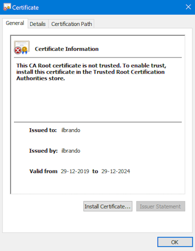

## WebDev
WebDev er et hjælpeværktøj til udviklere - primært webudviklere - hos Unik.

### Installation

#### Tekniske krav
Windows 10 version 17763

#### Download
Programmet er signeret med et self-signed certifikat, hvilket Windows ikke opfatter som 
en pålidelig kilde og dermed vil Windows ikke afvikle programmet.

Du skal hente [certifikatet](../ilbrando.cer) og installere det under
*Trusted Root Certificate Authorities*.

**Sådan gør du:**

**1 Åbn certifikatet og klik på *Install Certificate***

**2 Vælg at certifikatet installeres i *Local machine***

**3 Vælg at certifikatet installeres i *rusted Root Certificate Authorities***

**4 Klik *Next* indtil guiden er afsluttet.**

**5 Installer programmet**
[Download WebDev](https://ilbrando.blob.core.windows.net/webdev/WebDev.Packaging_x64.appinstaller) og installer programmet.